<p align="center">
  
</p>

# Descripción

Volantis-SMS es un sistema web para la gestión centralizada de ventas de múltiples tiendas. Desarrollado utilizando AdonisJS 6 y React 19.

## Características

- Gestión de productos (CRUD)
- Asignación de productos a tiendas
- Gestión de proveedores (CRUD)
- Gestión de órdenes de compra (CRUD)
- Gestión de clientes (CRUD)
- Gestión de presentaciones de productos (CRU)
- Gestión de tiendas (CRU)
- Gestión de usuarios del sistema (Crear, deshabilitar, resetear credenciales, modificación de rol y permisos, asignar usuario a tienda, restablecimiento de foto de perfil y envío de e-mail de recuperación)
- Gestión de roles y permisos (CRUD)
- Módulo simple de ventas (Búsqueda de productos por código de barras EAN-13)
- Visualización y búsqueda de comprobantes de pago (PDF)
- Recuperación de credenciales de acceso (Envío de e-mail)
- Permisos de acceso al sistema basado en roles y permisos/habilidades (Cada rol puede poseer varios permisos, los cuales pueden ser modificados)
- Reporte de ventas (diario, semanal, mensual y anual)
- Configuración del sistema (IGV, permitir o no ventas con stock <= 0)
- Envío de e-mail durante: Recuperación de cuenta, actualización de correo electrónico, actualización de contraseña y restablecimiento remoto de credenciales de acceso a cuenta.
- Cierre remoto de sesiones (Al recuperar cuenta, actualizar contraseña o restablecer acceso)
- Prohibir el acceso al sistema a usuarios específicos (deshabilitar cuenta)
- Cada tienda posee un catálogo de productos disponibles independiente, (precio + stock variable) todas las tiendas comparten los productos "base" (sin propiedades)

## Tecnologías y dependencias

- [React v19](https://react.dev/) (Componentes)
- [React Router v7](https://reactrouter.com/) (Frontend)
- [AdonisJS v6](https://adonisjs.com/) (Backend)
- [Tailwind](https://tailwindcss.com/) (Interfaces)
- [DaisyUI](https://daisyui.com/) (Interfaces)
- [@fontsource/roboto](https://www.npmjs.com/package/@fontsource/roboto) (Tipografía)
- [@iconify/react](https://iconify.design/) (Iconos)
- [SweerAlert2](https://sweetalert2.github.io/) (Alertas)
- [chart.js](https://www.chartjs.org/) (Librería graficos)
- [react-chartjs-2](https://react-chartjs-2.js.org/) (Librería graficos)
- [sindresorhus/ky](https://github.com/sindresorhus/ky) (Peticiones HTTP)
- [playwright](https://playwright.dev/) (Librería para PDF)
- [react-hook-form](https://react-hook-form.com/) (Librería para formularios)
- [js-cookie](https://www.npmjs.com/package/js-cookie) (Librería para cookies)
- [Day.js](https://day.js.org/) (Librería para fechas/horas)
- [Edge.js](https://edgejs.dev/docs/introduction) (Motor de plantillas para emails)

## Requisitos

- [NodeJS Versión >=20](https://nodejs.org/en)
- [Base de Datos (MySQL recomendada)](https://www.mysql.com/)

## Uso

Cumplidos los requisitos para ejecutar el proyecto puedes probar el sistema siguiendo estos pasos:

- Clonar el repositorio. `git clone https://github.com/zNahuelz/volantis-sms.git`

---

### Configuración de backend

- Debes crear un archivo .env en el directorio api usando como referencia el archivo .env.example del mismo directorio.
- Configura la conexión a la base de datos en él .env (MySQL recomendada):

```
DB_HOST=127.0.0.1
DB_PORT=3306
DB_USER=USUARIO_BD
DB_PASSWORD=CONTRASEÑA_BD
DB_DATABASE=NOMBRE_DB
```

- Configurar el servicio de correo para envío de emails en el .env (Se utilizó GMail durante las pruebas). Debes generar una contraseña de aplicación, puedes seguir la guía oficial de Google [aquí](https://support.google.com/accounts/answer/185833?hl=es):

```
SMTP_HOST="smtp.gmail.com"
SMTP_PORT=587
SMTP_USER=CORREO_ELECTRÓNICO
SMTP_SECRET=CONTRASEÑA_APP_GMAIL
```

- Añadir URL del frontend en la configuración.
  `REACT_FRONTEND_URL="http://localhost:3000"`
- Descargar dependencias del proyecto (en directorio api): `npm i`
- Configurar entorno: Cambiar la variable NODE_ENV según se requiera. `NODE_ENV=development` ó `NODE_ENV=production`
- Ejecutar migración de la base de datos: `node ace migration:run`
- Ejecutar inicialización de la base de datos con datos de prueba: `node ace db:seed`
- Esto creará 3 cuentas de usuario por defecto. También crea datos de productos, presentaciones, tipos de pago, series de comprobantes de venta, proveedores y clientes de prueba. Pueden ser modificados en el sistema o con un gestor de bases de datos. NOTA: El entorno de desarrollo genera alrededor de 100 entidades de prueba por tabla (clientes, proveedores, productos, presentaciones) mientras que el entorno de producción genera solo las entidades necesarias para el correcto funcionamiento del sistema (tipos de pago, series de comprobantes de venta, cuentas de usuario por defecto, tienda y cliente genérico)
- La cuenta de prueba para administrador es: admin (Mismo usuario-contraseña)
- La cuenta de prueba para gerente es: manager (Mismo usuario-contraseña)
- La cuenta de prueba para vendedor es: seller0 (Mismo usuario-contraseña)
- Ejecutar el backend: `npm run dev`

---

### Configuración de frontend

- Debes crear un archivo .env en el directorio frontend usando como referencia el archivo .env.example del mismo directorio.
- Llenar `VITE_API_URL=URL_BACKEND` con la URL del backend en el archivo .env del directorio frontend.
- Descargar dependencias del proyecto (en directorio frontend): `npm i`
- Ejecutar el frontend: `npm run dev`

## Imágenes

Bienvenida al sistema
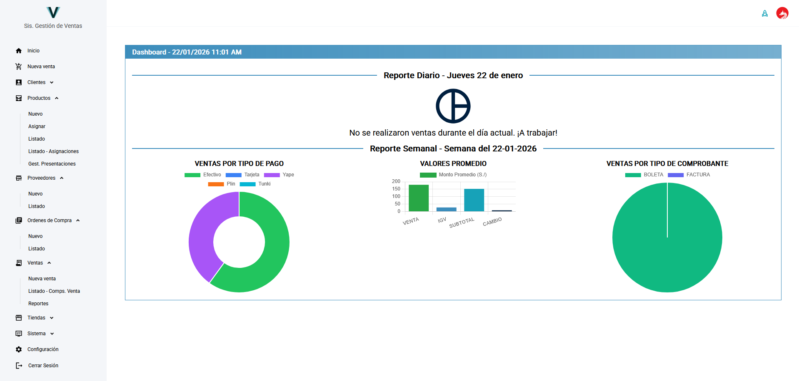

Listado de productos (asignados a tiendas)
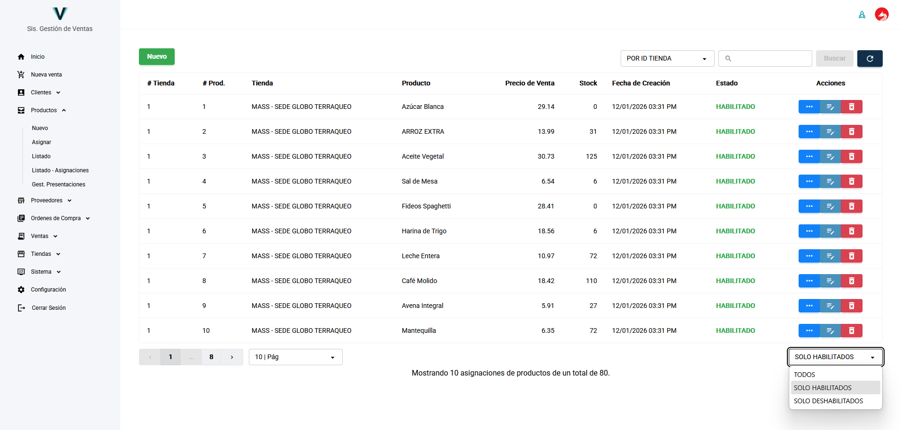

Registro de productos
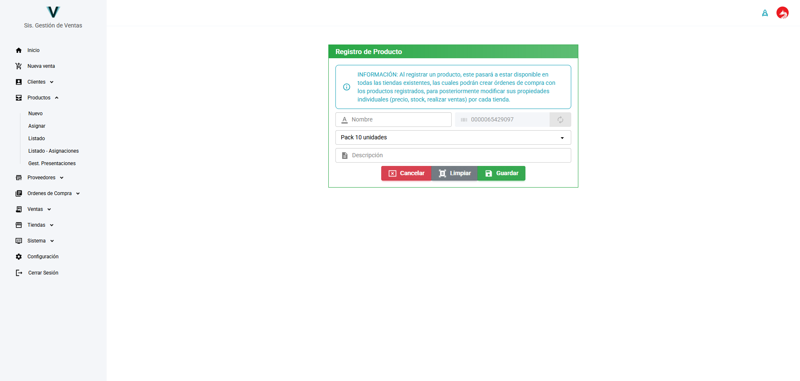

Registro de orden de compra
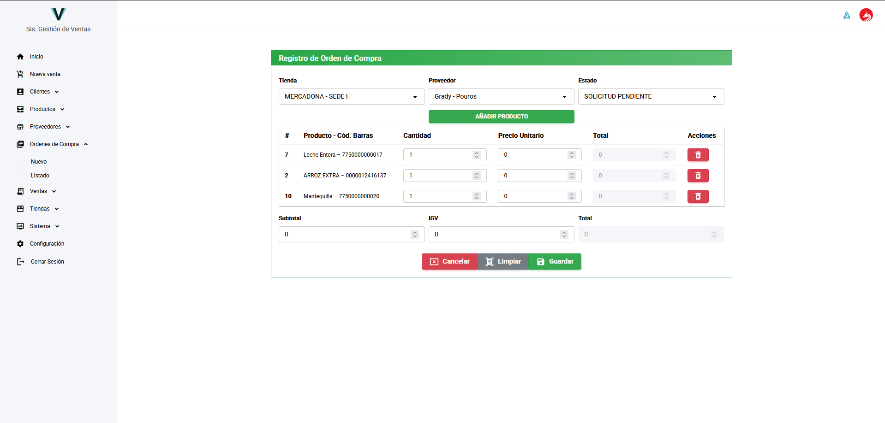

Listado de comprobantes
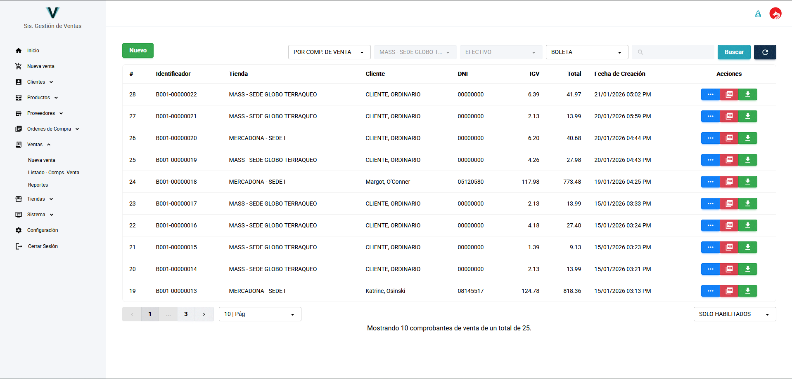

Detalle de comprobante en PDF
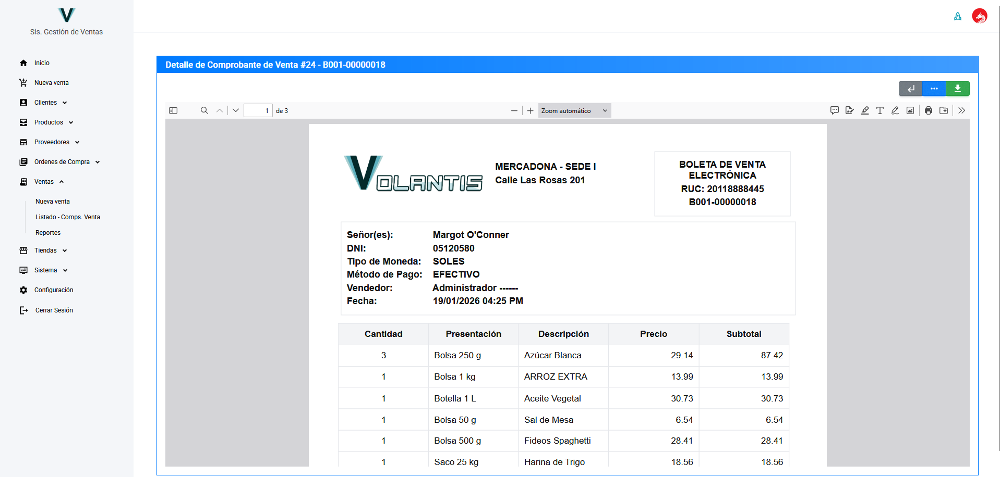

Detalle de comprobante
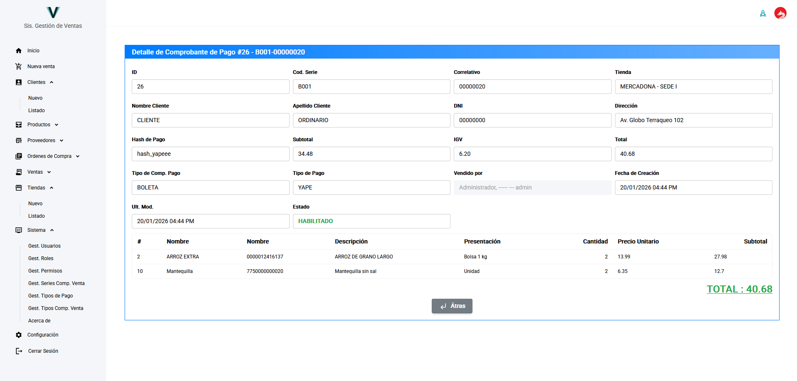

Asignar producto a tienda
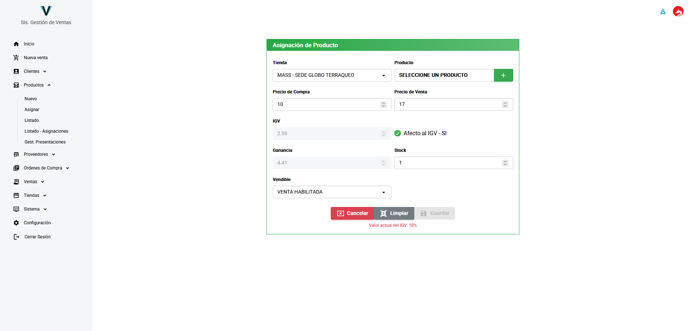

Correo electrónico de restablecimiento de credenciales
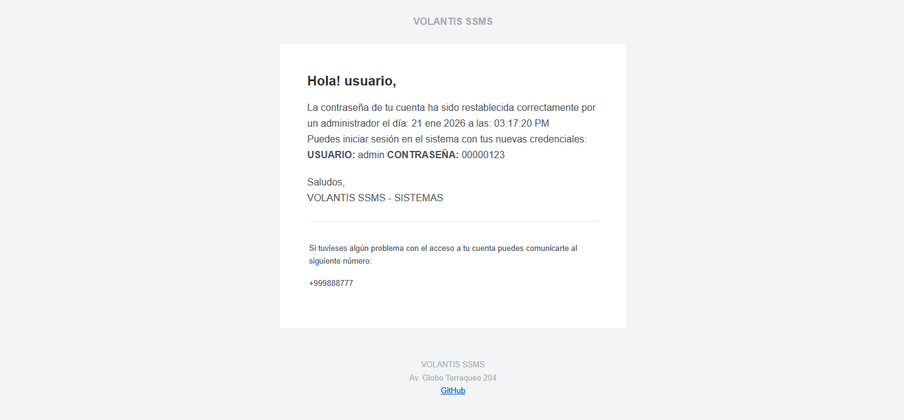

Módulo de ventas
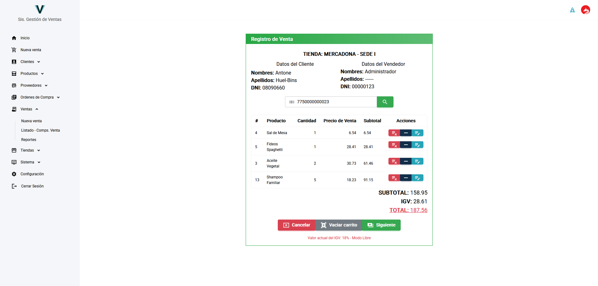

Reporte de ventas
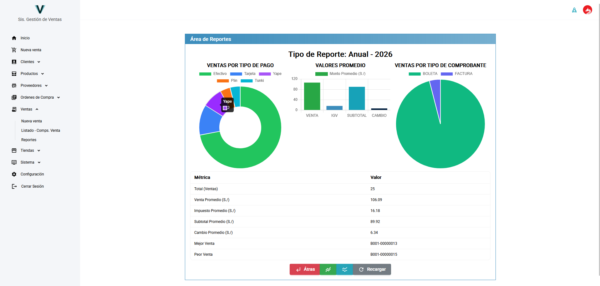

Gestión de usuario
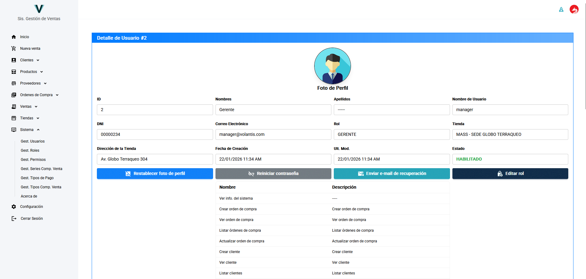

Configuración del sistema
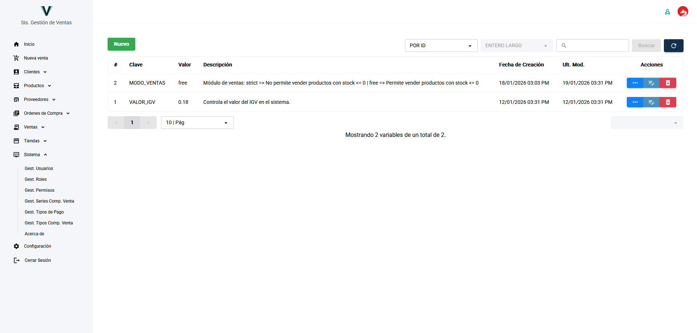

Perfil de Usuario
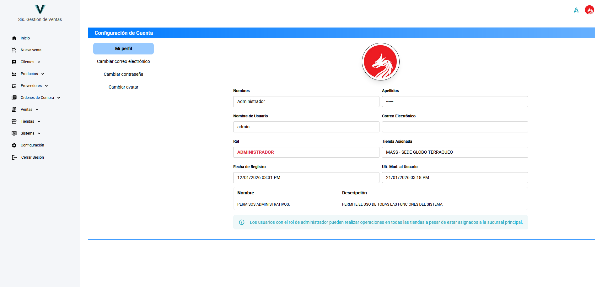
